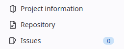
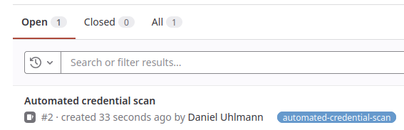
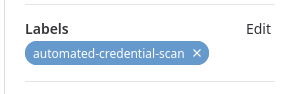
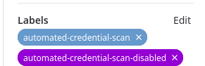

# Opt-Out of Scanning your Repository
Navigate to your repository

Go to issues:

Open our automatically generated scanner issue:

Choose "Edit" on the right site under "Labels"
(by default there is a label called "automated-credential-scan")

Add a new Label called "automated-credential-scan-disabled" to the already existing issue:

Save everything and you are done. If you wish, you can close the issue now and you will never get bothered again.
